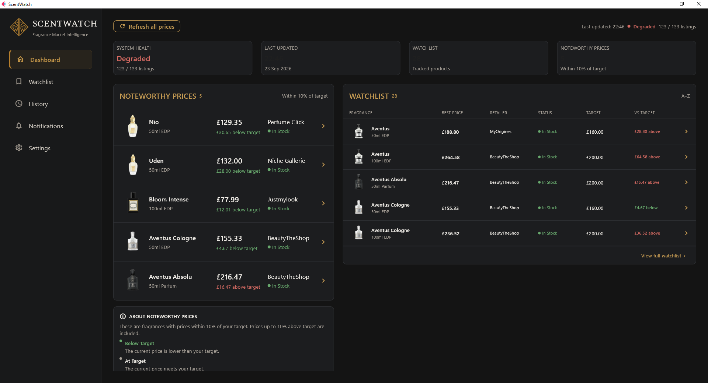
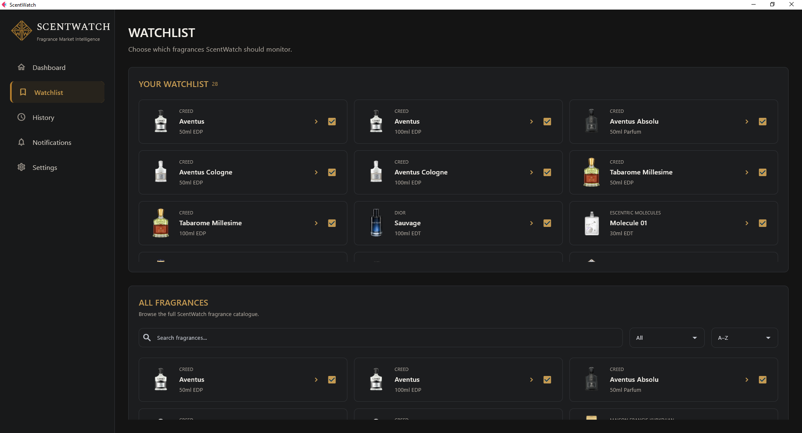
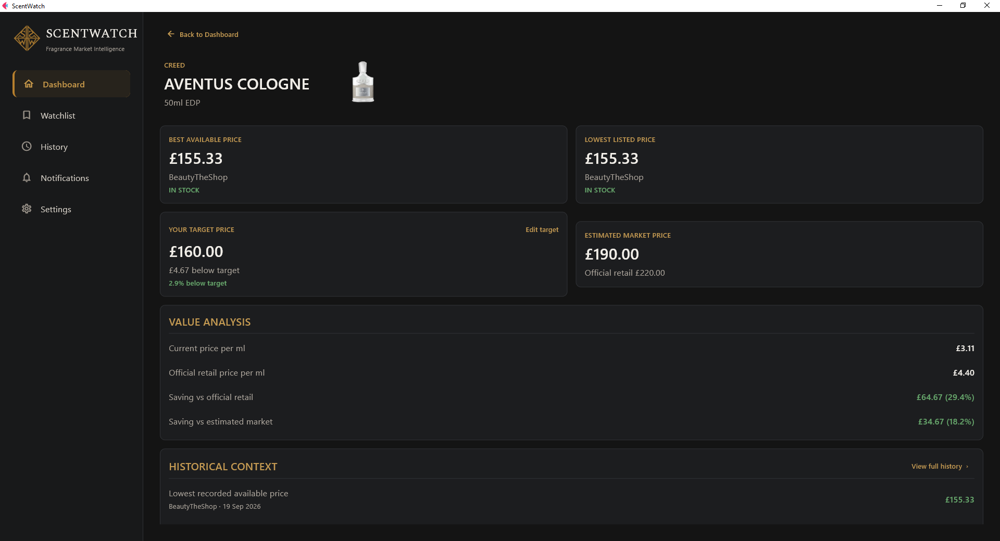
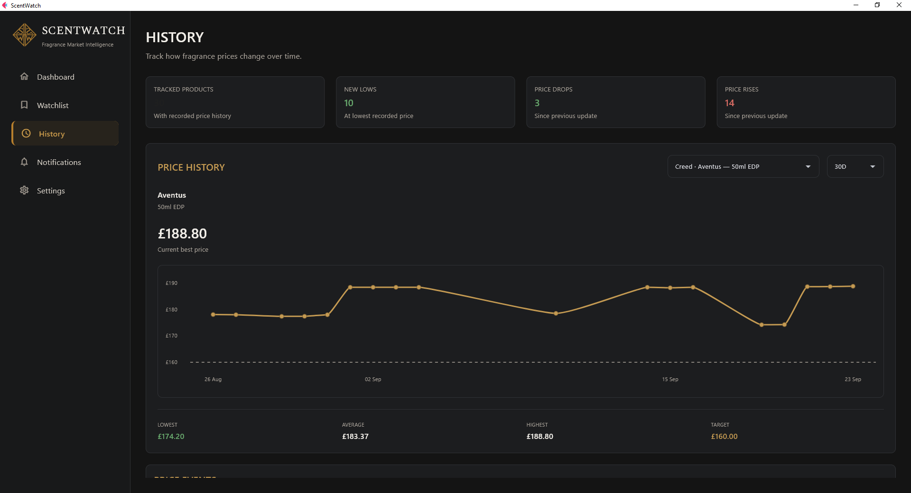

# ScentWatch

### Fragrance price intelligence for the UK market

ScentWatch is a Windows application designed to make fragrance pricing easier to understand.

Rather than simply showing the cheapest price available today, ScentWatch tracks supported fragrances across multiple UK retailers, compares current prices with your personal targets, builds historical pricing data and highlights prices that may genuinely be worth paying attention to.

**ScentWatch 1.0 Beta is now available for testing.**

## ScentWatch in Action

### Dashboard

See your Watchlist, latest pricing and noteworthy market opportunities at a glance.

### Watchlist

Build a personal fragrance Watchlist, browse the supported catalogue and set the prices that matter to you.

### Product Details

Explore current retailer pricing, your personal target and market information for individual fragrances.

### Price History

Put today's price into context with historical observations collected by ScentWatch.

## What ScentWatch Does

Fragrance prices can vary substantially between retailers and over time. Discounts are frequent, recommended retail prices are often poor indicators of actual market value, and a price advertised as a sale is not necessarily unusual.

ScentWatch is designed around a simple idea:

**A useful fragrance price needs context.**

ScentWatch brings together current pricing, historical pricing and personal target prices to provide that context.

## Features

### Personal Watchlist

Build a Watchlist from the supported fragrance catalogue and set your own target price for each fragrance.

Targets are optional, so fragrances can also be tracked simply to observe their market pricing.

### Multi-Retailer Price Scanning

ScentWatch checks supported UK fragrance retailers and compares available listings for the fragrances you are following.

Manual scans can be started whenever you want updated pricing.

### Noteworthy Prices

ScentWatch analyses current prices against the information available to it and highlights pricing events worth paying attention to.

This is intended to make it easier to distinguish genuinely interesting prices from ordinary fluctuations and routine discounts.

### Price History

Explore how fragrance prices have changed over time rather than judging today's price in isolation.

ScentWatch 1.0 Beta includes an initial historical price dataset so that a new installation can provide useful market context immediately instead of beginning with an empty history.

As you use ScentWatch, your own scans continue building that pricing history.

### Product Details

Individual fragrance pages bring together current pricing, retailer information, targets and historical context in one place.

### Automatic Scanning

Optional scheduled scans allow ScentWatch to check prices automatically at configurable times while the application is running.

### Notifications

ScentWatch can provide Windows notifications for relevant pricing events and completed automatic scans.

Notification categories can be configured within Settings.

### Light & Dark Modes

Choose the appearance that works best for you. Both themes have been designed as part of the ScentWatch interface rather than treating Dark Mode as an afterthought.

## ScentWatch 1.0 Beta

This is the first external beta release of ScentWatch.

The beta has undergone internal functional, fresh-install and packaged-build testing, but wider testing is now needed across different Windows systems and real-world usage.

Feedback is particularly valuable around:

- First-launch onboarding
- General usability and navigation
- Watchlist and target management
- Price scanning
- Dashboard and price information
- Product Details and History
- Automatic scanning
- Notifications
- Light and Dark Mode
- Reliability and persistence
- Missing fragrances or retailers
- Features that feel unnecessary or incomplete

For the full beta testing guide and feedback questionnaire, see `TESTING.md`.

## Download

The current test release is:

**ScentWatch 1.0 Beta for Windows**

Download `ScentWatch_V1.0_Beta_Windows.zip` from the latest ScentWatch GitHub Release.

Do not download the automatically generated GitHub "Source code" archives if your intention is simply to install and test ScentWatch.

## Installation

ScentWatch 1.0 Beta currently uses a portable-style Windows distribution and does not require a traditional installer.

1. Download `ScentWatch_V1.0_Beta_Windows.zip`.
2. Extract the ZIP to a folder of your choice.
3. Open the extracted `ScentWatch_V1.0_Beta_Windows` folder.
4. Run `ScentWatch.exe`.
5. Complete the first-launch onboarding.
6. Add some fragrances to your Watchlist and start exploring.

Keep the extracted application files together rather than moving `ScentWatch.exe` out of its folder on its own.

## Windows Security Notice

ScentWatch 1.0 Beta is currently an unsigned beta application.

Because the application has not yet been digitally code-signed, Microsoft Defender SmartScreen or Windows may display a warning indicating that the publisher is unknown or that the application is unrecognised.

This does not by itself indicate that ScentWatch has detected malicious behaviour. It reflects the lack of a recognised code-signing certificate for this beta build.

Only run software you have obtained from a source you trust.

## Your ScentWatch Data

ScentWatch stores your personal application state separately from the application folder.

This includes information such as:

- Your Watchlist
- Target prices
- Settings
- Notifications
- Collected current pricing
- Price history generated through your use of ScentWatch

This means replacing or moving the application folder does not normally remove your existing ScentWatch data.

ScentWatch 1.0 Beta does not require you to create a ScentWatch account.

## Historical Pricing

A new ScentWatch installation includes an initial historical pricing dataset.

This is intentional.

Without existing observations, a new price-tracking application has very little context with which to interpret today's market. The included history allows ScentWatch to provide useful historical information from the beginning while subsequent scans continue adding new observations.

Historical prices should be treated as market observations rather than a guarantee that a product was continuously available at a particular price.

## Catalogue & Retailer Coverage

ScentWatch uses a curated fragrance catalogue and a defined set of supported retailer listings.

It is **not currently intended to be a universal search engine for every fragrance, retailer or bottle size on the internet**.

This approach allows retailer coverage and pricing behaviour to be tested and maintained rather than accepting arbitrary product pages with unknown compatibility.

Fragrance requests may be considered for future inclusion. Availability, retailer coverage and technical compatibility can affect whether a requested fragrance is suitable to add.

Retailer websites can also change independently of ScentWatch. A website change may therefore temporarily prevent ScentWatch from retrieving a price from an individual source until support is updated.

## Beta Feedback

Beta feedback is extremely valuable.

You do not need to complete the entire testing questionnaire to contribute. Comments about something you liked, disliked, found confusing or expected to work differently are useful.

If you encounter a bug, it helps to include:

- Your Windows version
- What you were trying to do
- What you expected to happen
- What actually happened
- Whether the issue can be reproduced
- The fragrance or retailer involved, if relevant
- Any error message
- A screenshot where appropriate

See `TESTING.md` for the complete testing guide.

## Current Scope

ScentWatch 1.0 Beta is currently focused on:

**Platform:** Windows  
**Market:** United Kingdom  
**Currency:** GBP  
**Release stage:** Beta  
**Distribution:** Portable ZIP

Additional platforms, retailers, fragrances and capabilities may be considered as ScentWatch develops.

## Privacy

ScentWatch 1.0 Beta does not require a ScentWatch user account.

The beta does not include an analytics or telemetry system for automatically collecting your usage behaviour.

Beta feedback is provided voluntarily by testers.

## Known Beta Considerations

As an early beta release:

- Individual retailer integrations may occasionally stop working when retailer websites change.
- Coverage is deliberately curated and incomplete.
- Automatic scans require ScentWatch to be running.
- The Windows application is currently unsigned.
- Bugs and unexpected behaviour may still occur.

Please report anything that appears incorrect rather than assuming it is expected beta behaviour.

## The Goal

ScentWatch is being developed around the idea that fragrance buyers should have better information about the prices they are seeing.

A discount percentage alone does not tell you whether a fragrance is actually well priced.

By combining current retailer pricing, historical observations and the price that matters to you personally, ScentWatch aims to make fragrance buying decisions better informed.

---

**ScentWatch 1.0 Beta**

Built for fragrance enthusiasts who would rather know whether a price is actually good than simply be told that it is on sale.
